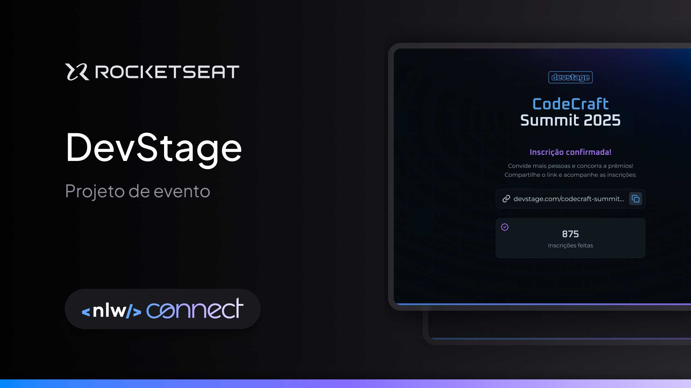

<h1 align="center"> NLW CONNECT - FULLSTACK TRACK  </h1>

The project is a registration form for an event called CodeCraft Summit 2025, an event made by and for developers who are passionate about creating innovative solutions and sharing knowledge. It includes a registration screen and a confirmation screen. This is one of the projects from the NLW CONNECT event, an event that can transform your career, just as it has already transformed the careers of thousands of other developers.

  <a href="#-tecnologias">Technologies</a>&nbsp;&nbsp;&nbsp;|&nbsp;&nbsp;&nbsp;
  <a href="#-projeto">Project</a>&nbsp;&nbsp;&nbsp;|&nbsp;&nbsp;&nbsp;
  <a href="#-layout">Layout</a>&nbsp;&nbsp;&nbsp;|&nbsp;&nbsp;&nbsp;
  <a href="#memo-licença">License</a>

  

 

  

## 🚀 Technologies
This project was developed with the following technologies:
- HTML, CSS and JavaScript
- Git & GitHub
- Figma
- Responsively

## 💻 Project
This project is a registration form for CodeCraft Summit 2025, an event made by and for developers passionate about creating innovative solutions and sharing knowledge.

The project features two main screens:

 <strong>Registration Screen:</strong> Where users can sign up for the event. 
 <strong>Confirmation Screen:</strong> Displayed after successful registration.

The project is built using HTML, CSS, and JavaScript and is part of the NLW CONNECT - FULLSTACK TRACK.

- [Access the finished project](https://andreskull2.github.io/nlw-connect-fullstack/)
- [Watch the classes](https://www.rocketseat.com.br/formacao/fullstack)

## 🔖 Layout
You can view the project layout through [LINK](https://www.figma.com/community/file/1471120839033505457). A Figma account is required to access it.[Figma](https://figma.com).

## :memo: License
This project is licensed under the MIT License.

---
Made with ♥ by Rocketseat :wave: [Join our community!](https://discord.gg/rocketseat)